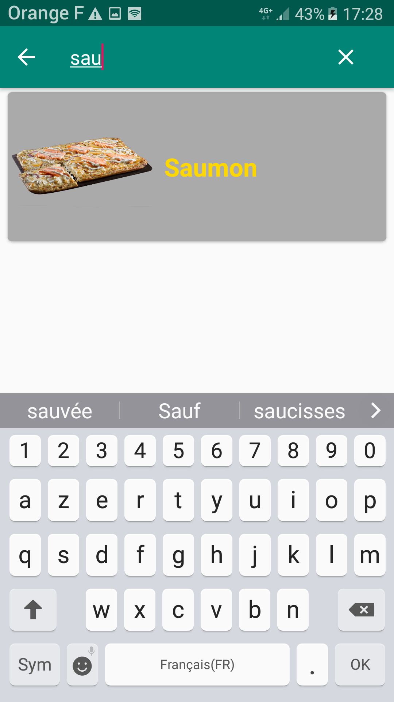

# Projet-Mobile
## Fait par
Glandières Nathanaël Groupe 34 3A

## Présentation

Projet d'application mobile affichant une liste de pizzas que l'utilisateur peut sélectionner afin d'obtenir la recette correspondante. Cette application respecte le pattern MVVM et elle a été développée en suivant un gitflow.

## Consignes respectées :

- Pour une note minimale :

	- Deux écrans : Un écran avec une liste (RecyclerView) et un écran avec un détail de l’item.
	- Appel WebService à une API Rest.
	- Stockage des données en cache.

- Consignes bonus : 

	- Architecture MVVM
	- Gitflow
	- Notifications Push ( Firebase )

- Fonctions supplémentaires :
	
	- Création d'une API personnalisée (rly-chrono.fr/api/pizzas)
	- Barre de recherche (SearchView)

## Fonctionnalités: 

### Ecran de base 

#### Liste des Pizzas

- Cet écran affiche la liste des pizzas avec la photo leur correspondant. 

       

#### Barre de recherche

- La barre de recherche située en haut à droite permet de filtrer les pizzas par leur nom.

### Ecran recette

- Cet écran affiche l'image de la pizza, avec en dessous son nom. Il affiche aussi les ingrédients nécessaires pour la réaliser et les étapes pour la préparer.

